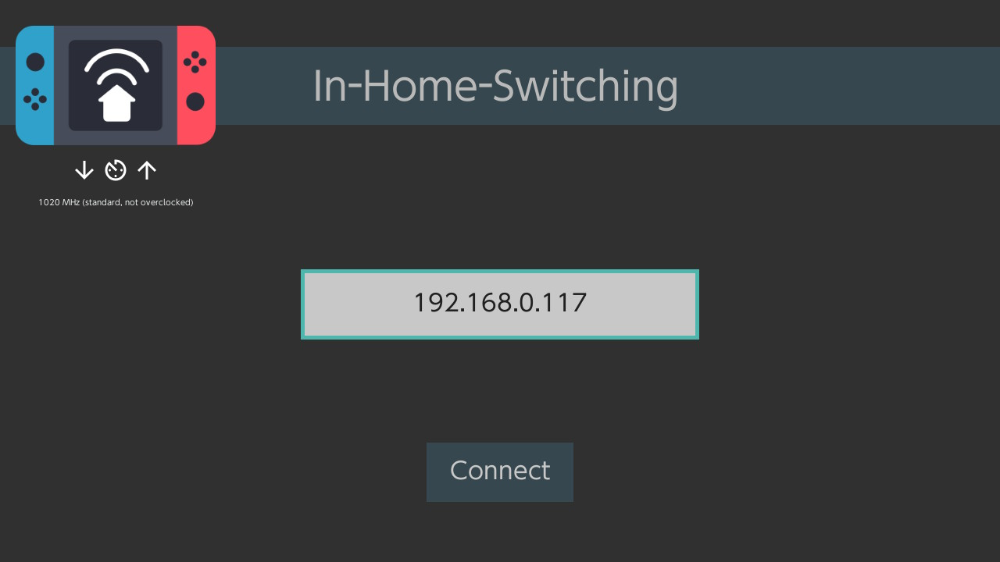
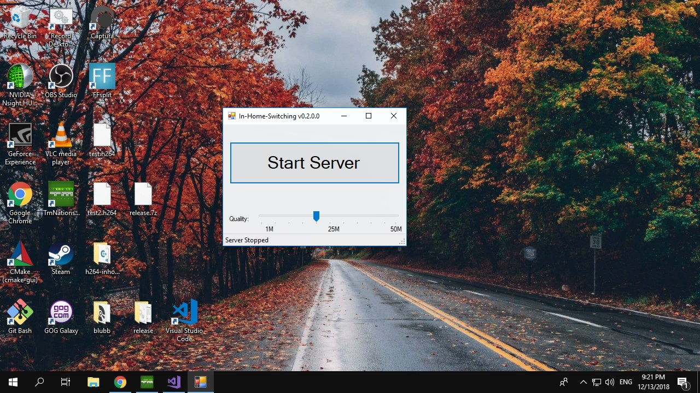

# In-Home-Switching

 

This is a homebrew that enables streaming of PC games to the Nintendo Switch.

Have you ever been told by your parents that spending hours sitting in front of a PC was bad for you (like I was)? Well, now you can play your games portably anywhere in your house!

This project is fairly new, so please do not consider it totally stable. If you encounter issues, feel free to submit them.

## Features:
  * Stream PC screen to a Nintendo Switch in your local network
    * 720p (full Switch-Tablet display resolution)
    * 40-60 FPS (if not see Troubleshooting)
    * Low delay (again, see Troubleshooting)
  * Capture controller input on Nintendo Switch
    * Emulate an Xbox controller on the PC
  * PC app offers picture quality adjustments

## How to Use
If you do not want to build by yourself, have a look at the [releases page](https://github.com/jakibaki/In-Home-Switching/releases). There you can find an Archive with the App for the Switch as well as the corresponding PC companion app. For the PC App, just execute In-Home-Switching.exe in the Windows directory after unzipping. 

The latest release uses a desktop app as a server that can be left running waiting for a connection from your switch. This means you only need to start it once, and then you'll be able to re-connect to it from your switch as many times as you want (providing it doesn't crash). So go sit on your couch and stream some PC games!

On PC:
  1. Install [Scp drivers](https://github.com/mogzol/ScpDriverInterface/releases/download/1.1/ScpDriverInterface_v1.1.zip) (just unzip and execute `Driver Installer/ScpDriverInstaller.exe`). Otherwise the program will crash silently.
  1. Set your PC resolution to `1280x720` in Windows for getting **much** better performance of screen capturing while running the app.
  1. Run the desktop app `In-Home-Switching.exe`
  1. In the desktop app, Start the server by clicking `Start Server`
  1. Find the `IP address` of your desktop (you'll need this on the switch)

On the Switch:
  1. Copy the homebrew app `In-Home-Switching.nro` to your switch
  1. Launch the homebrew app
  1. Hit the textbox to enter the `IP address` of your desktop running the server
  1. Hit the `Connect` button.

## Screenshots from Nintendo Switch

## Current Limitations
  * Only works with Windows 8 (64-bit) and newer
  * No audio support atm
  * No support for Switch CFW other than [Atmosphère](https://github.com/Atmosphere-NX/Atmosphere) or [Kosmos](https://github.com/AtlasNX/Kosmos)

## Known issues
  * So far Switch crashes when put to sleep with app running (please close app beforehand, we have not fixed this issue yet)
  * App breaks when Switch changes from docked to handheld mode or vice-versa. Please quit the app before doing so.

## Further notices
This app uses core overclocking to 1785 MHz on the Nintendo Switch. We use this measure in order to decode the incoming videos efficiently. As far as we know, there have been no reported cases of this damaging any devices. In other words, it is considered safe. Still we do not warrant for any potential device damage caused by this homebrew.

## Scheduled for Future Releases
  * Stream PC audio to Switch
  * Option to disable Switch Overclocking
  * MacOS and Linux Support
  * Showing Switch IP in-app
  * Multi-controller support
  * Mouse emulation
  * More efficient threading
  * GPU encoding on PC

## Build instructions
The following steps were done on Windows 10.

### Compile homebrew
1. Install devkitpro from [here](https://devkitpro.org/wiki/devkitPro_pacman)
1. Run the newly installed `MSYS2` cmd prompt
1. From MSYS2 cmd, install patch command by running `pacman -S patch`
1. From MSYS2 cmd, install pkg-config by running `pacman -S pkg-config`
1. From MSYS2 cmd, install SDL2 packages by running `pacman -S switch-sdl2 switch-sdl2_gfx switch-sdl2_image switch-sdl2_mixer switch-sdl2_ttf switch-glad`
1. Get the patched ffmpeg build by running  `git clone -b ffmpeg_networking https://github.com/jakibaki/pacman-packages.git`
1. Navigate to the `pacman-packages/switch/ffmpeg` directory and compile the package by running: `makepkg -sL`
1. Install the built package by running `pacman -U switch-ffmpeg-4.0.1-1-any.pkg.tar.xz`
1. Navigate to `In-Home-Switching\`
1. Compile the homebrew by running `make`

### Compile desktop app
1. Copy `ScpDriverInterface.dll` from the [Scp drivers zip](https://github.com/mogzol/ScpDriverInterface/releases/download/1.1/ScpDriverInterface_v1.1.zip) to `In-Home-Switching\Windows\`
1. Open `In-Home-Switching\Windows\In-Home-Switching-Win\In-Home-Switching-Windows.sln` in Visual Studio
1. Build the solution

## Troubleshooting

### *Nice videos, but sadly that delay makes it unplayable*

If you are experiencing delays greater than 0.1 seconds, either your PC is just too slow for your chosen quality options (try worsening image quality) or your local network is bad. Basically we need instant data transfer in your network to work properly (this has nothing to do with throughput, just latency).  
Some WiFi-routers unfortunately just aren't up to the task.

### *These framedrops hurt my eyes!*

Your PC is probably too slow for encoding with the games/applications on. Try other applications, lower image quality and, if you haven't already, set your PC screen resolution to 1280x720p (saves scaling).

### *No drops, but my framerate is just very low*

Well, in our tests we had 60 FPS on Windows 10 with low image quality... I guess you can try the same strategies as for fixing framedrops, I hope that helps.

## License

This code is licensed GPLv3 and this has a reason: We do not want to see (or read about) any parts of this project in non-open-source software (everything that is not GPLv3 licensed). Please share the notion of free code for everyone.

## Credits to

* [ffmpeg](https://www.ffmpeg.org/) for being such a powerful media tool that we use on PC and Switch.
* [SwitchBrew](https://switchbrew.org/) for libNX and its ffmpeg inclusion
* [Atmosphère](https://github.com/Atmosphere-NX/Atmosphere) for being such a great Switch CFW
* [Captura](https://github.com/MathewSachin/Captura) for showing us how to capture frame input with Windows Duplication API
* [simontime](https://github.com/switch-stuff/switch-usb-screen-stream-sharp) for his switch-usb-screen-stream-sharp project for Windows
* [ScpDriverInterface](https://github.com/mogzol/ScpDriverInterface/) for the Xbox drivers on Windows
* [Guillem96](https://github.com/Guillem96) for greatly improving our code quality
* [NX-Shell](https://github.com/joel16/NX-Shell) for teaching us how to use SDL
* [Checkpoint](https://github.com/FlagBrew/Checkpoint) also for SDL examples
* [SunTheCourier](https://github.com/SunTheCourier) for adding config support to our Windows client
